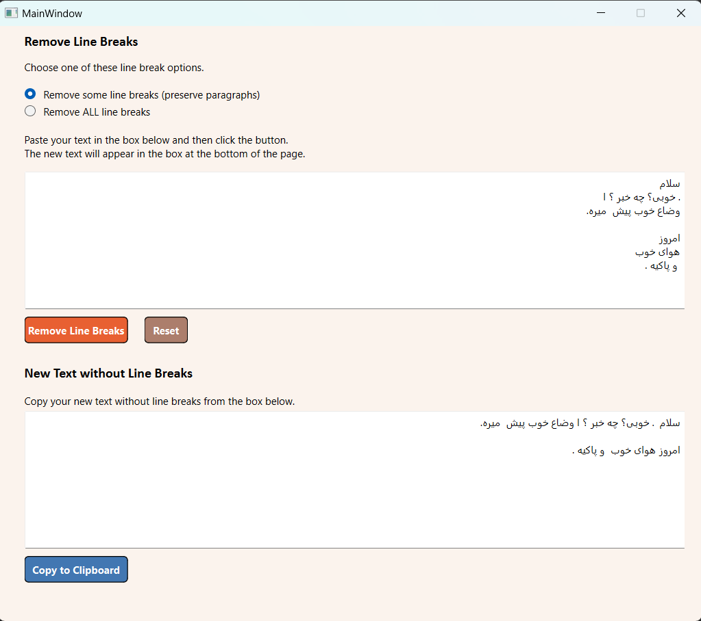

# Line Removal Tool


This Line Removal Tool is a simple application built with Python using PySide6 library. It provides functionality to remove empty lines from text inputs.
<center>

</center>

---

## Installation:
Ensure you have Python installed on your system. You can install PySide6 using pip:

```
pip install PySide6
```
---

## Usage:

1. Run the program by executing the following command:
```
python line_break_removal.py
```

2. The application window will open with a text input area.
3. Enter your text in the input area.
4. Choose whether you want to remove empty lines on a per-line basis or per-paragraph basis by selecting the respective radio button.
5. Click the "Remove Line Breaks" button to process the text.
The processed text will appear in the result area.
6. Click the "Copy to Clipboard" button to copy the processed text to the clipboard.
7. Click the "Reset" button to clear both input and result areas.

---

[Watch App Video](files/LineBreakRemoval.mp4)

---
### Credits

Designer: Zahra Eslami